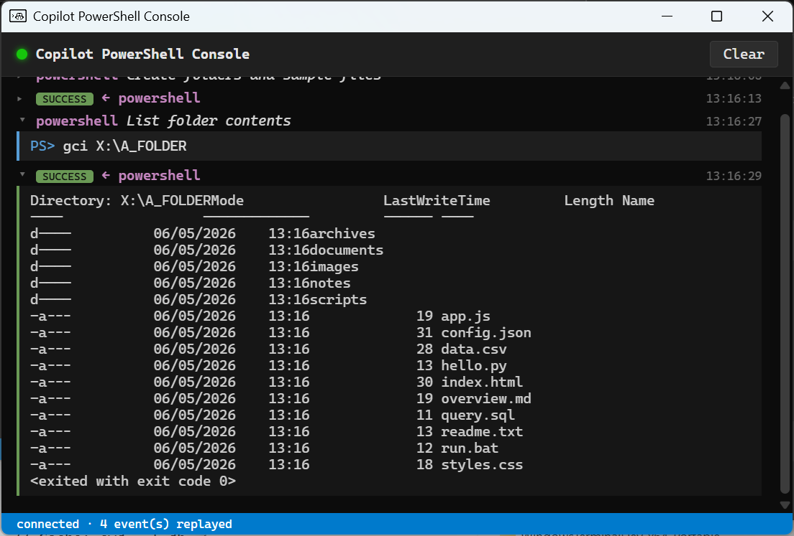

# copilot-ps-console-view


A [GitHub Copilot CLI](https://github.com/github/copilot-cli) extension that opens
a desktop window showing every PowerShell command Copilot runs in your session,
along with its output — rendered console-style in real time.



## What it captures

The extension hooks into Copilot CLI's tool lifecycle and shows entries for
every call to:

- `powershell` (sync and async commands)
- `write_powershell` (input sent to a running session)
- `read_powershell` (buffered output reads)
- `stop_powershell`
- `list_powershell`

Each command is shown with a colour-coded status tag (`success`, `failure`,
`rejected`, `denied`, plus a pulsing grey `pending` while the result is in
flight). Calls and results are paired into a single collapsible entry,
with the input text under "Input" and the captured output under "Output".

Async sessions get special treatment: see [Sessions](#sessions) below.

## Requirements

- Windows 10 / 11 (the WebView2 runtime ships with the OS).
- [Node.js](https://nodejs.org/) **20 or newer** on `PATH` (`node`, `npm`).
- [GitHub Copilot CLI](https://github.com/github/copilot-cli) installed and signed in.
- (Only when installing with `-FromGitHub`) `git` on `PATH`, or
  [GitHub CLI](https://cli.github.com/) (`gh auth login`) for tarball
  fallback / private-repo access.

## Install

You can install the extension **per-project** (only available in one repo) or
**globally** (available to your user account in every Copilot CLI session).

### From a local clone (default)

Clone the repo once, then run the installer. The script copies your current
working tree into the discovery directory — modifications, untracked files,
and feature branches are all preserved.

```powershell
git clone https://github.com/pacovidal/copilot-ps-console-view.git
cd copilot-ps-console-view

# Per-project (current directory must be inside a git repo)
.\scripts\install.ps1 -ProjectPath C:\path\to\my\project

# Or globally
.\scripts\install.ps1 -Scope Global
```

This places the extension at either:

- `<project>\.github\extensions\copilot-ps-console-view\` (per-project — the
  project must be a git repository for Copilot CLI to discover it), or
- `%USERPROFILE%\.copilot\extensions\copilot-ps-console-view\` (global).

You can delete the original clone afterwards; the installed copy is
self-contained.

### From GitHub (no clone needed)

To install in one line, without cloning, fetch the bootstrap script and
pipe it to `iex`. It will ask whether you want a per-project or global
install:

```powershell
irm https://raw.githubusercontent.com/pacovidal/copilot-ps-console-view/main/scripts/install-remote.ps1 | iex
```

For non-interactive installs, or to override defaults like `-Ref` or
`-RepoUrl`, download the bootstrap to disk and invoke it directly. Any
arguments are forwarded to `install.ps1` (with `-FromGitHub` already set),
and passing any argument suppresses the interactive prompt:

```powershell
$bootstrap = "$env:TEMP\cpcv-install-remote.ps1"
irm https://raw.githubusercontent.com/pacovidal/copilot-ps-console-view/main/scripts/install-remote.ps1 -OutFile $bootstrap

# Globally
& $bootstrap -Scope Global

# A specific branch / tag
& $bootstrap -Ref my-feature-branch
```

If you already have a clone and just want to skip the local-copy default,
run `.\scripts\install.ps1 -FromGitHub` directly. `-Ref` and `-RepoUrl`
imply `-FromGitHub` if you pass them without it.

### Installer parameters

| Parameter      | Default              | Notes |
|----------------|----------------------|-------|
| `-Scope`       | `Project`            | `Project` or `Global` |
| `-ProjectPath` | current dir          | Only used when `-Scope Project` |
| `-FromGitHub`  | off                  | Fetch from GitHub instead of using the local working tree |
| `-Ref`         | `main`               | Only used with `-FromGitHub`. Branch or tag |
| `-RepoUrl`     | this repo            | Only used with `-FromGitHub`. Override for forks / mirrors |
| `-Force`       | off                  | Overwrite an existing install |

## Usage

After installation:

1. Reload Copilot CLI (`/reload-extensions` or restart the CLI). You'll see
   a message confirming the extension is loaded.
2. Open the console window with the slash command:

   ```
   /ps-console-view
   ```

3. The window stays open for the rest of the session and streams every
   PowerShell command Copilot runs.

The window auto-scrolls and supports word-wrap. Use **Clear** to reset both the
on-screen log and the in-memory history buffer.

The extension also registers three tools the agent can use directly:

- `ps_console_view_show` — open or focus the window
- `ps_console_view_eval` — run JS inside the page
- `ps_console_view_close` — close the window

## Sessions

When Copilot starts a long-running shell with `powershell --mode=async`, the
console renders it as a **session entry** instead of a simple paired entry.
Subsequent `write_powershell`, `read_powershell`, and `stop_powershell` calls
that target the same `shellId` are folded into the session's body as a
**transcript** — one labelled line per interaction:

- `▶ Started` — the initial command and its captured startup output
- `→ Sent` — input written into the session
- `◉ Read` — output read back from the session
- `⏹ Stopped` — when the session is explicitly stopped

The header shows a status tag (`pending` → `active` → `stopped`), the
`shell=<id>` chip, the start time, and a live duration that ticks while
the session is `active` and freezes once it stops.

`list_powershell` calls render as a single-line entry (`☰ Listed N active
session(s)`). To declutter, right-click → **✓ Show list_powershell entries**
toggles them off for the current session.

If a `write_powershell`/`read_powershell`/`stop_powershell` call references
a `shellId` whose start was never observed (extension reloaded mid-session,
history aged out, etc.), it renders as an "orphan continuation" mini-entry
tagged with the missing shellId rather than crashing or being attached to
an unrelated session.

## Themes

The console ships with seven built-in colour schemes (default-dark,
default-light, solarized-dark, solarized-light, campbell, one-half-dark,
tango-dark) and picks `default-light` or `default-dark` on first run based
on your OS appearance preference.

Switch themes via the right-click context menu → **Theme ▸**. Your choice
is remembered across sessions.

To add your own theme, drop a `.css` file into:

- `<extension-install-dir>\themes\` (default; preserved across upgrades), or
- the directory pointed at by `$env:COPILOT_PS_CONSOLE_THEMES_DIR`.

Reopening the Theme submenu picks up new files automatically. See
[`content/themes/README.md`](content/themes/README.md) for the variable
reference and a copy-pastable starter template.

## Known limitations

### Reconstructed call entries (the `◇` marker)

A small dim diamond next to a tool name means the call entry was
reconstructed from the result, because the live "tool starting" hook never
reached this extension. This is caused by an upstream Copilot CLI bug:
`runAgenticLoop` snapshots its hooks once at loop start, and after an
`extensions_reload` mid-loop the snapshot still references the dead old
extension's IPC connection. Subsequent `preToolUse` invocations silently
fail. The result still arrives via the live `postToolUse` path, so the
extension synthesizes a placeholder call event from the post hook's
arguments and pairs it. The command + output are accurate; only the live
"running" view was missed. Fixed automatically on the next user prompt
(which restarts `runAgenticLoop` and refreshes the snapshot).

### Same-args parallel mispairing (rare)

When two PS calls have byte-identical summarized arguments AND their
results arrive out of pre-hook order (one fails so its post never fires,
or two parallel `read_powershell` calls with the same `shellId` + `delay`
complete out of order), the pair-matching can swap their entries — call A
will display result B and vice versa. Single isolated mispair, no broader
poisoning.

### Diagnostic log

Set `COPILOT_PS_CONSOLE_DEBUG=1` in your shell environment before
launching Copilot CLI to enable a JSONL diagnostic log at
`<extension-install-dir>\_debug.log`. Useful for filing issues if you
see unexpected behavior.

## Uninstall

```powershell
# Per-project (run from inside the project)
.\scripts\uninstall.ps1

# Global
.\scripts\uninstall.ps1 -Scope Global
```

## Development

```powershell
git clone https://github.com/pacovidal/copilot-ps-console-view.git
cd copilot-ps-console-view
npm install
```

For local hacking, symlink (or copy) the working tree into the discovery folder:

```powershell
# project-scoped
New-Item -ItemType Junction `
  -Path "C:\path\to\project\.github\extensions\copilot-ps-console-view" `
  -Target "C:\path\to\copilot-ps-console-view"
```

Then reload Copilot CLI extensions after edits. Webview content (`content/`)
can be hot-refreshed by invoking the `ps_console_view_show` tool with
`reload: true` — no full extension reload needed.

### Layout

```
copilot-ps-console-view/
├── extension.mjs         # bootstrapper (runs npm install if needed)
├── main.mjs              # joinSession, hooks, callbacks
├── lib/                  # generic copilot-webview library (verbatim)
├── content/              # the webview page
│   └── themes/           # built-in themes + author guide
├── scripts/              # install.ps1, uninstall.ps1
├── package.json
├── LICENSE               # MIT
└── README.md
```

## Credit

This extension was built using [Copilot WebView Creator](https://github.com/SteveSandersonMS/copilot-webview-creator) 

## License

MIT — see [LICENSE](./LICENSE).
